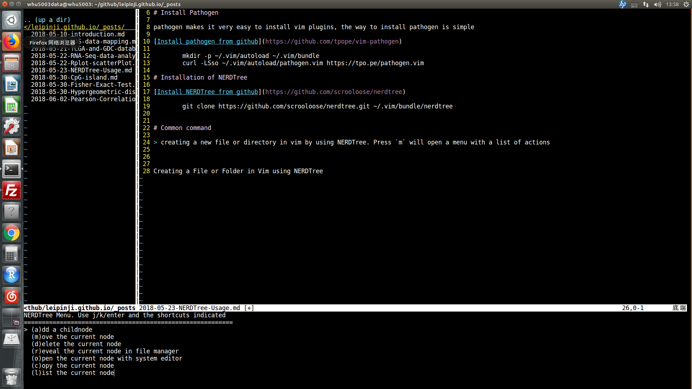

# Install Pathogen

pathogen makes it very easy to install vim plugins, the way to install pathogen is simple

[Install pathogen from github](https://github.com/tpope/vim-pathogen)

	mkdir -p ~/.vim/autoload ~/.vim/bundle
	curl -LSso ~/.vim/autoload/pathogen.vim https://tpo.pe/pathogen.vim

# Installation of NERDTree

[Install NERDTree from github](https://github.com/scrooloose/nerdtree)

	git clone https://github.com/scrooloose/nerdtree.git ~/.vim/bundle/nerdtree

# Common command

## creating a new file or folder in vim using NERDTree

	press `m` to open a menu with a list of actions

