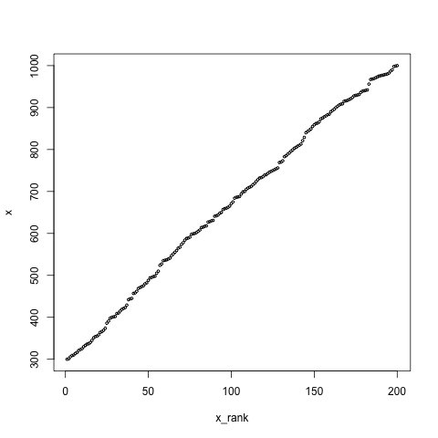
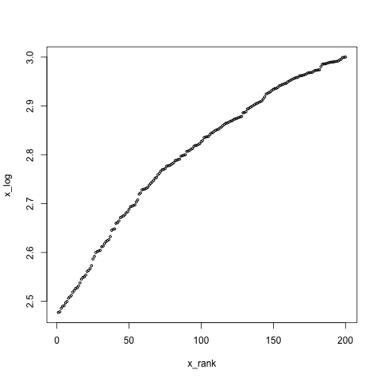
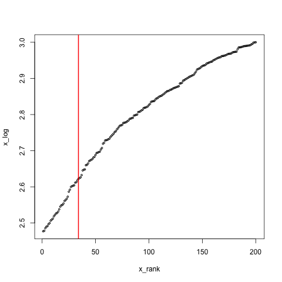

# R inflection point

```{r,echo=TRUE,message=TRUE}
x<-sample(300:1000,size = 200)
x_rank<-rank(x)
plot(x_rank,x,cex=0.5)
```



```{r,echo=TRUE,message=TRUE}
x_log<-log10(x)
plot(x_rank,x_log,cex=0.5)
```



```{r,echo=TRUE,message=TRUE}
x_order<-order(x)
x_o<-x_rank[x_order]
rawdiff<-diff(x_log)/diff(x_o)
inflection<-which(rawdiff==min(rawdiff[1:length(rawdiff)]))
plot(x_rank,x_log,cex=0.5)
abline(v=inflection,col="red",lwd=2)
```



